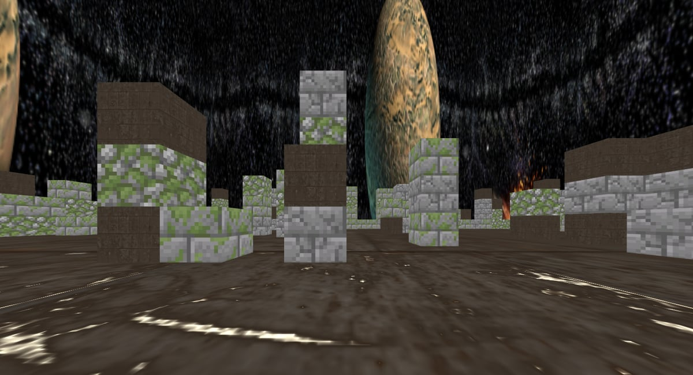

For UC Santa Cruz's CSE 160 (Introduction to Computer Graphics) I built a run of interactive renderers that each added a piece of the graphics pipeline. Apart from the final project, everything uses raw WebGL and hand-written GLSL shaders, with no engine.

All of them run in the browser:

- **[Paint](https://anthony-reyna.com/CS160/assignment1/src/ColoredPoints.html).** Drawing with points, triangles, and circles on a WebGL canvas.
- **[Blocky animal](https://anthony-reyna.com/CS160/blockyAnimal/BlockyAnimal.html).** A hierarchical model built from cubes and pyramids, with joint animation driven by a scene graph of transforms.
- **[Block world](https://anthony-reyna.com/CS160/blockyWorld/World.html).** A first-person world with a movable camera, texture mapping, a skybox, and a bit of in-game dialogue to set the scene.
- **[Lighting](https://anthony-reyna.com/CS160/lighting/World.html).** Phong lighting with normals, a movable point light, and a spotlight, with on-screen controls.
- **[three.js scene](https://anthony-reyna.com/CS160/final/index.html).** A claw machine in an arcade, using loaded glTF/FBX models, HDR environment lighting, soft shadows, and orbit controls.

## What I took from it

Writing matrices, camera math, and shaders by hand made it clear what an engine does every frame. That's the base I'm building on now with Unreal Engine.
